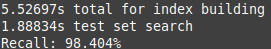
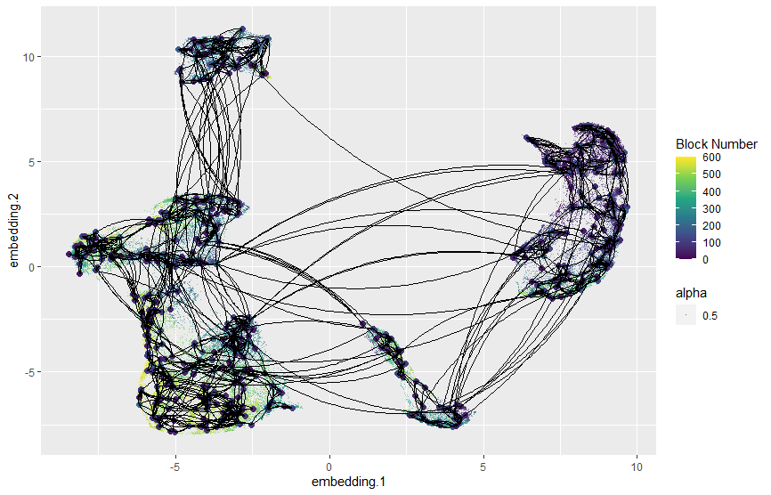

# Recursive Nearest Neighbor Descent (rNND)

Parallelized the search algorithm. Rest of parallelizing the algorithm is mostly part of the clean up. Very close to what a theoretical beta release would look like (with A LOT of cleaning up). 

rNND is a (WIP) C++ implementation of the Nearest Neighbor Descent algorithm. The NND algorithm creates an approximation of an k-Nearest Neighbors graph for a large dataset. The goal of this project is to develop a version of NND that can be highly distributed by handling small portions of the developing graph at a time.
The NND algorithm is presented in ["*Efficient k-nearest neighbor graph construction for generic similarity measures*" by Dong et. al.](https://doi.org/10.1145/1963405.1963487)
[Leland McInnes](https://github.com/lmcinnes), author of [UMAP](https://github.com/lmcinnes/umap) and [PyNNDescent](https://github.com/lmcinnes/pynndescent) has helped greatly by providing guidance on this project.

At the time of writting, this code is unreleased and not published under a license. As a result, I currently retain all legal rights I am legally entitled to. I am currently considering using a permissive liscense for releasing this code, such as the Apache 2.0 w/LLVM exception. I will update this notice when an appropriate license has been picked.

Embedded meta graph connecting each block to the two blocks with the most neighbors out of block.

# Project Goals

- Header only library
- Have only the C++ Standard Library as a dependancy
- Produce a generic and efficient implementation

This project uses the C++20 standard. I do plan on including some manually vectorized functions using compiler intrinsics located in the immintrin.h header that will be used by default with a mechanism to easily opt-out of them.

# The Billion-Scale Approximate Nearest Neighbor Search Challenge 

I have submitted this project to the T2 track of the Billion-Scale Approximate Nearest Neighbor Search Challenge. More information on this challenge may be found [here](https://big-ann-benchmarks.com/). This algorithm will not be implementing vector quantitization, as it is still aiming to serve dimensionality reduction algorithms; I seek to build an index that retains as much spatial information as reasonably possible.

The abstract for the submission is:

PyNNDescent is a core component of the Python implementation of Uniform Manifold Approximation and Projection (UMAP). UMAP's primary computational bottleneck is the formation of an approximate k nearest neighbors graph. PyNNDescent tackles forming the graph by combining two algorithms: Random Projection Trees (RPTrees) and Nearest Neighbor Descent (NND). RPTrees covers one of NND's weaknesses by initializing the graph. This is achieved by spatially partitioning the input data, and forming subgraphs within each leaf. This initialization is followed by adding new neighbors to each point at random. Then, NND iterates over the vertices in the graph. NND searches for new candidate neighbors by polling the neighbors of neighbors.

Recursive Nearest Neighbor Descent (rNND) is both a reimplementation of and iteration upon PyNNDescent. rNND is currently being developed in C++ as a header only library with the C++ Standard Library as its only core dependency. The algorithmic improvements rNND seeks to implement aim to address two problems with NND: low locality of computations and requiring random access to the entire graph.

To tackle these weaknesses, rNND uses the results of RPTrees to cluster the entire data set into blocks of data for each spatial partition. This allows reconceptualizing NND iterations into operations between blocks of data. However, this leads to the question of how to tackle the additional bookkeeping of the blockwise operations. Due to the way RPTrees partitions space, rNND assumes that the points in each leaf have the majority of their k nearest neighbors in the k' nearest leaves. For truly massive datasets, the k' nearest leaves problem can use this same analysis; the leaves can be clustered, and each leaf can search the k'' nearest clusters. This analysis will be used to efficiently organize and distribute computations between blocks of data.

# Project State

So far, a serial version of NND has been implemented. This project has a lot further to go before being usable, including:

Currently in progress:
- Fix search algo assumptions
- Angular RP-Trees
- Inner Product Metric
- MetaGraph Recursion

Upcoming:

- Index I/O

Further down the road (post big-ANN):
- GPU support
- Distributed computing

