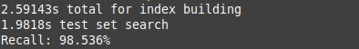

# Recursive Nearest Neighbor Descent (rNND)

Parallelized the search algorithm. Rest of parallelizing the algorithm is mostly part of the clean up. Very close to what a theoretical beta release would look like (with A LOT of cleaning up). 

rNND is a (WIP) C++ implementation of the Nearest Neighbor Descent algorithm. The NND algorithm creates an approximation of an k-Nearest Neighbors graph for a large dataset. The goal of this project is to develop a version of NND that can be highly distributed by handling small portions of the developing graph at a time.
The NND algorithm is presented in ["*Efficient k-nearest neighbor graph construction for generic similarity measures*" by Dong et. al.](https://doi.org/10.1145/1963405.1963487)
[Leland McInnes](https://github.com/lmcinnes), author of [UMAP](https://github.com/lmcinnes/umap) and [PyNNDescent](https://github.com/lmcinnes/pynndescent) has helped greatly by providing guidance on this project.

At the time of writting, this code is unreleased and not published under a license. As a result, I currently retain all legal rights I am legally entitled to. I am currently considering using a permissive liscense for releasing this code, such as the Apache 2.0 w/LLVM exception. I will update this notice when an appropriate license has been picked.

Embedded meta graph connecting each block to the two blocks with the most neighbors out of block.

# Project Goals

- Header only library
- Have only the C++ Standard Library as a dependancy
- Produce a generic and efficient implementation

This project uses the C++20 standard. I do plan on including some manually vectorized functions using compiler intrinsics located in the immintrin.h header that will be used by default with a mechanism to easily opt-out of them.

# Project State

So far, a serial version of NND has been implemented. This project has a lot further to go before being usable, including:

Currently in progress:
- Other Distance Metrics
- MetaGraph Recursion

Big maybe:
- GPU support
- Distributed computing

